# OLA Ride Analytics — Power BI & SQL & Excel

An end-to-end data analytics project using **Microsoft Excel, SQL, and Power BI** to analyze OLA ride-booking data, understand booking outcomes, study vehicle performance, evaluate revenue and payment behavior, and identify cancellation and rating patterns.

## 📌 Project Overview

This project analyzes ride-booking data from an OLA-style ride-hailing dataset. Excel is used for initial data cleaning and preparation, SQL is used to answer focused business questions and extract analytical results, and Power BI is used to turn the data into an interactive dashboard.

The analysis focuses on:

- Booking volume and booking status
- Successful vs. cancelled rides
- Vehicle-type performance
- Booking value and revenue
- Payment-method behavior
- Customer activity
- Cancellation reasons
- Driver and customer ratings
- Ride distance and travel patterns

---

## 🎯 Business Objectives

The main objectives of this project are to:

1. Measure overall booking and successful-ride performance.
2. Understand the distribution of successful and cancelled bookings.
3. Compare booking value and travel distance across vehicle types.
4. Analyze payment methods and their contribution to booking value.
5. Identify highly active customers.
6. Understand major customer and driver cancellation reasons.
7. Evaluate driver and customer ratings across vehicle categories.
8. Present the findings through an interactive Power BI report.

---

## 🧹 Data Cleaning & Preparation

The raw booking data was prepared before analysis to improve consistency and usability.

Key preparation activities included:

- Reviewing column names and data types
- Checking for missing and null values
- Validating date and time fields
- Reviewing booking-status values
- Checking categorical fields such as vehicle type and payment method
- Reviewing cancelled and incomplete rides
- Preparing the dataset for SQL analysis and Power BI visualization

**Data cleaning tool:** Microsoft Excel

---

## 🛠️ Tools & Technologies

| Tool | Purpose |
|---|---|
| **Microsoft Excel** | Data cleaning, validation, and preparation |
| **SQL / MySQL** | Data querying and analytical calculations |
| **Power BI** | Interactive dashboards and visualization |
| **CSV** | Source dataset |
| **GitHub** | Project documentation and version control |

---

## 📂 Project Structure

```text
OLA-Ride-Analytics-PowerBI-SQL/
│
├── README.md
├── Bookings.csv
├── Ola DA Project.pbix
├── Ola DA Project SQL.sql
│
└── images/
    ├── dashboard-overall.png
    ├── dashboard-vehicle-type.png
    ├── dashboard-revenue.png
    ├── dashboard-cancellation.png
    ├── dashboard-ratings.png
    │
    ├── sql-01-booking-data.png
    ├── sql-02-vehicle-average.png
    ├── sql-03-booking-count.png
    ├── sql-04-top-customers.png
    ├── sql-05-cancellation-count.png
    ├── sql-06-rating-range.png
    ├── sql-07-vehicle-ratings.png
    ├── sql-08-successful-value.png
    ├── sql-09-incomplete-rides.png
    └── sql-10-additional-analysis.png
```

> **Note:** Rename your screenshots using the names above and place them inside the `images` folder. The README uses relative paths, so it does not depend on any external GitHub repository or local Windows file path.

---

# 📊 Power BI Dashboard

The Power BI report contains five analytical sections.

## 1. Overall Performance

The Overall dashboard provides a high-level view of booking activity.

Key metrics shown include:

- **Total Bookings:** 99.95K
- **Successful Bookings:** 62.05K
- **Total Booking Value:** approximately 34M
- Booking-status distribution
- Daily ride volume

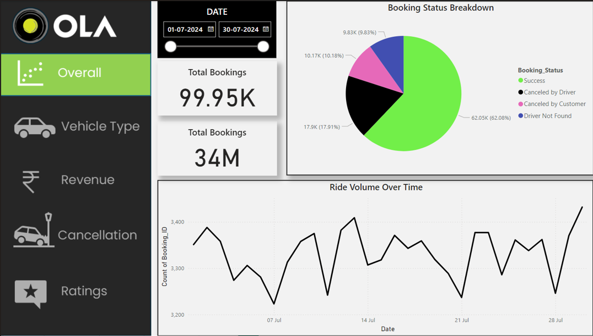

---

## 2. Vehicle Type Analysis

The Vehicle Type dashboard compares major OLA vehicle categories based on booking value and travel distance.

The report compares:

- Prime Sedan
- Prime SUV
- Prime Plus
- Mini
- Auto
- Bike
- E-Bike

Example metrics displayed include total booking value, successful booking value, average distance travelled, and total distance travelled.

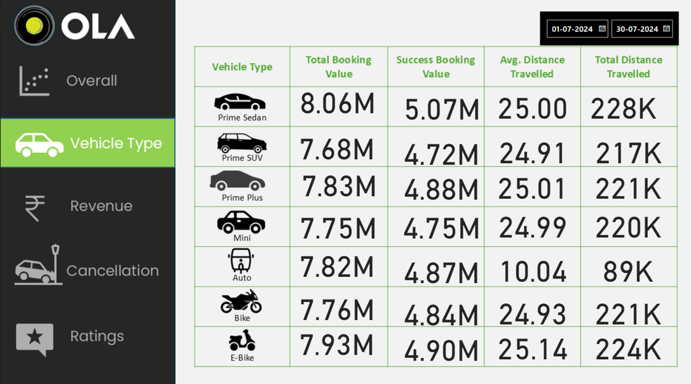

---

## 3. Revenue & Payment Analysis

The Revenue dashboard examines booking value by payment method and ride-distance trends over time.

The payment methods analyzed include:

- Cash
- UPI
- Credit Card
- Debit Card

The dashboard also highlights the top customers by booking value.

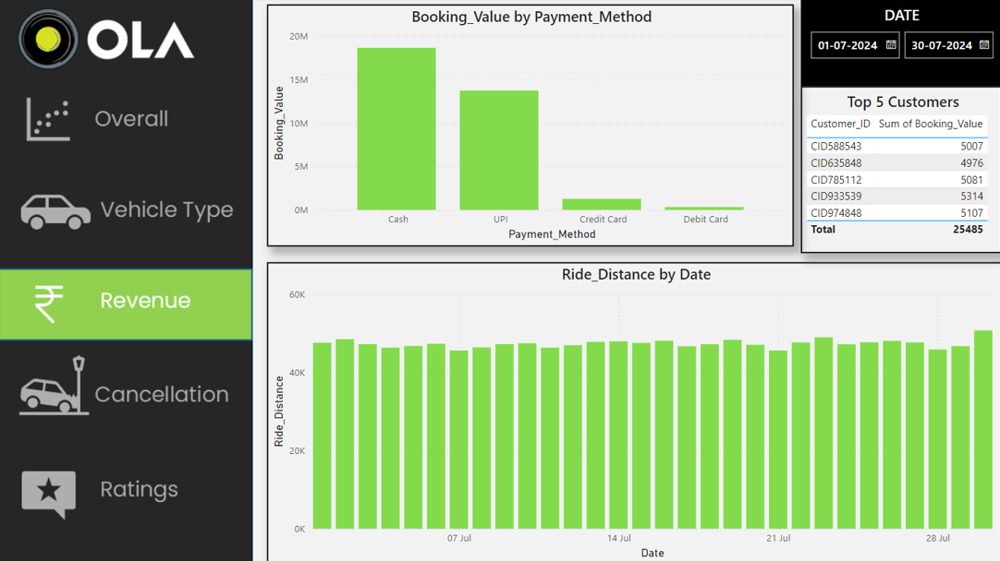

---

## 4. Cancellation Analysis

The Cancellation dashboard focuses on cancelled bookings and the reasons behind them.

Key metrics shown include:

- **Total Bookings:** 99.95K
- **Successful Bookings:** 62.05K
- **Cancelled Bookings:** 28.07K
- **Cancellation Rate:** 28.09%

The dashboard separates:

- Customer cancellations
- Driver cancellations
- Cancellation reasons

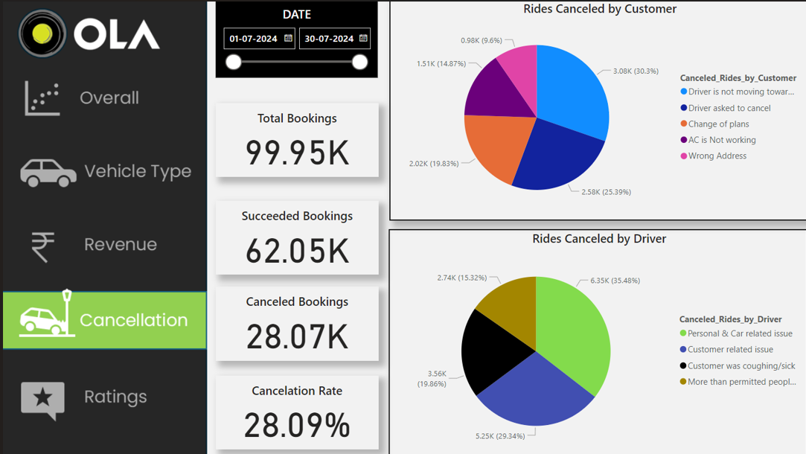

---

## 5. Ratings Analysis

The Ratings dashboard compares driver and customer ratings across vehicle types.

The displayed ratings are generally close to **4 out of 5**, allowing performance consistency across vehicle categories to be compared.

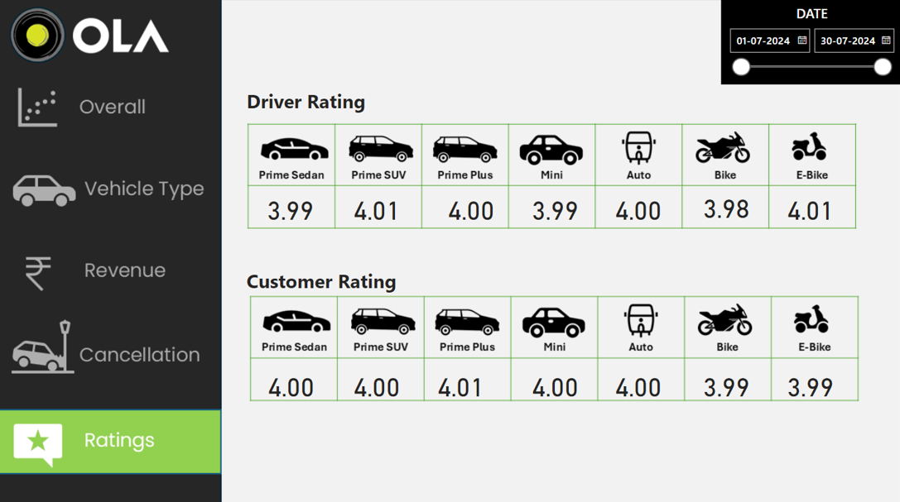

---

# 🧮 SQL Analysis

SQL was used to answer business-focused questions from the booking dataset.

The analysis includes queries for:

### 1. Successful Bookings

Retrieve bookings where:

```sql
Booking_Status = 'Success'
```

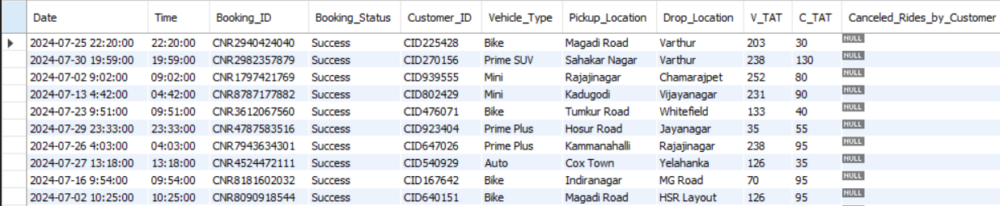

### 2. Average Ride Distance by Vehicle Type

Calculate the average ride distance for each vehicle category.

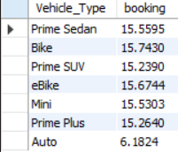

### 3. Booking Counts

Calculate booking counts for selected business conditions.

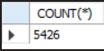

### 4. Top Customers

Identify customers with the highest number of rides.

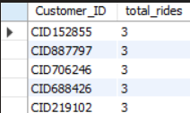

### 5. Customer Cancellations

Calculate the number of rides cancelled by customers.

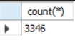

### 6. Rating Range

Find the minimum and maximum ratings for selected vehicle categories.

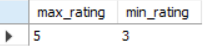

### 7. Average Ratings by Vehicle Type

Compare ratings across vehicle categories.

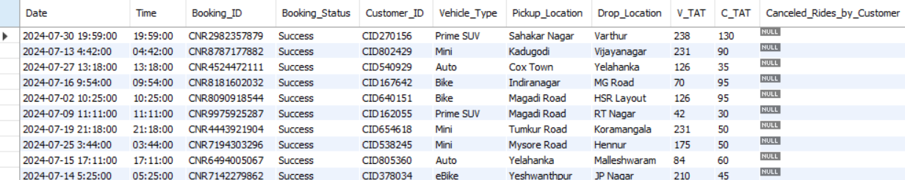

### 8. Successful Booking Value

Calculate the total booking value generated by successful rides.

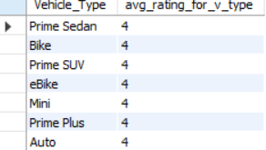

### 9. Incomplete Ride Analysis

Examine incomplete rides and the reasons associated with them.

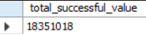

### 10. Additional SQL Analysis

Additional queries were used to explore booking-level information and identify patterns in the dataset.

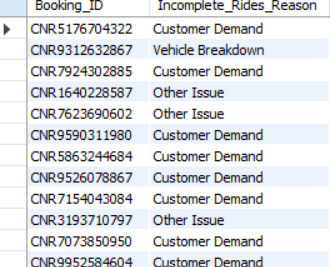

---

# 🔍 Key Findings

Based on the SQL outputs and Power BI report:

- The dashboard contains approximately **99.95K bookings**.
- Around **62.05K bookings** were successful.
- The reported cancellation rate is approximately **28.09%**.
- Total booking value is shown at approximately **34M** in the Power BI report.
- **Cash** contributes the largest booking value among the payment methods shown in the Revenue dashboard.
- Vehicle categories show different travel-distance patterns, with **Auto** having a noticeably lower average distance than the other vehicle categories in the SQL result.
- Driver and customer ratings are generally around **4/5** across vehicle types.
- Cancellation analysis shows multiple customer- and driver-related reasons that can be investigated to improve ride completion.
- The SQL analysis also identifies highly active customers and provides a way to investigate incomplete rides.

---

# 💡 Business Insights

The analysis can help a ride-hailing business:

- Monitor successful booking performance.
- Track cancellation levels and investigate their causes.
- Compare vehicle categories using revenue and distance metrics.
- Understand customer payment preferences.
- Identify high-value or highly active customers.
- Monitor driver and customer satisfaction through ratings.
- Identify operational issues contributing to incomplete rides.

---

# 📈 Dashboard Features

- Interactive date filtering
- Booking-status breakdown
- Ride-volume trend analysis
- Vehicle-type comparison
- Booking-value analysis
- Payment-method analysis
- Customer ranking
- Cancellation analysis
- Driver and customer rating comparison

---

# 🗃️ Dataset

The project uses a CSV-based ride-booking dataset containing booking-level information such as:

- Date and time
- Booking ID
- Booking status
- Customer ID
- Vehicle type
- Pickup and drop locations
- Vehicle and customer travel times
- Cancellation information
- Ride distance
- Driver/customer ratings
- Booking value
- Payment method
- Incomplete-ride information

---

# 🚀 How to Use the Project

### Power BI

1. Download the repository.
2. Open `Ola DA Project.pbix` in Power BI Desktop.
3. If required, update the dataset/source path.
4. Refresh the data.
5. Navigate through the report pages and interact with the filters.

### SQL

1. Open MySQL Workbench or another compatible SQL environment.
2. Import `Bookings.csv`.
3. Create/use the required database and table.
4. Open `Ola DA Project SQL.sql`.
5. Execute the queries to reproduce the analysis.

---

# 📌 Skills Demonstrated

- Data cleaning and preparation
- Microsoft Excel
- SQL querying
- Aggregation and grouping
- Filtering and conditional analysis
- Business-oriented data analysis
- Power BI dashboard development
- KPI design
- Data visualization
- Trend analysis
- Cancellation analysis
- Customer analysis
- Revenue analysis
- Analytical storytelling

---

# 👤 Author

**Rishi Chaudhary**

**Data Analytics | SQL | Excel | Power BI**

---

## ⭐ Project Note

This project is presented as a portfolio-oriented analysis of OLA ride-booking data. The dashboard and SQL analysis are documented here to demonstrate practical skills in data cleaning, data analysis, visualization, and business intelligence.

If you find the project useful, feel free to explore the SQL queries and Power BI report.
